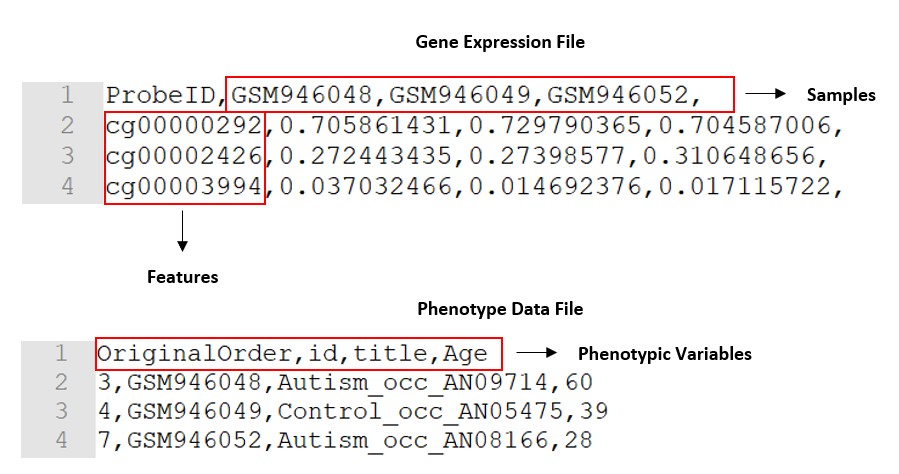
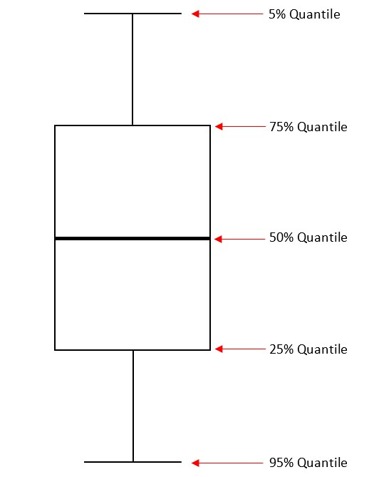

```{r setup, include=FALSE}
knitr::opts_chunk$set(echo = TRUE)
```

# Purpose

The purpose of this package is to provide a set of functions for performing statistical analyses of epigenomic data stored on federated databases. In particular the package utilizes DataSHIELD infrastructure which is a software solution that allows for the simultaneous co-analysis of data from multiple studies (stored on different databases), without the need to physically pool data or disclose sensitive information [@wilson_datashield_2017].  

At a high level DataSHIELD is set up as a client-server model where each server houses the data for a particular study. A request is made from the client to run specific functions on the remote servers where the analysis is performed. Non-sensitive and pre-approved summary statistics are returned from each study to the client where they can be combined for an overall analysis. An overview of what a single-site DataSHIELD architecture would look like is illustrated in Figure 1. 

```{r dsArchitectureDiag, echo=FALSE, fig.cap="Single Server DataSHIELD Architecture (Wilson et al 2017)", out.width = '90%', fig.align='center'}
knitr::include_graphics("singleSiteDSInfrastructure.jpg")
```

For more information on DataSHIELD as well as its implementation and setup see http://www.datashield.ac.uk/.

The functions implemented as part of this package allow a user to pre-process raw data into the form required by the Opal data warehouse component of DataSHIELD infrastructure, execute certain statistical tests on federated epigenomic data as well as generate specific graphical summaries of the data across studies. 

# Setup

## Required R Packages

In order to use the functions contained within this package the following R packages must be installed and loaded:

```{r requiredRPackages, warning=FALSE, message=FALSE}
library(opal)
library(dsBaseClient)
library(dsStatsClient)
library(dsGraphicsClient)
library(dsModellingClient)
library(dsBetaTestClient)
library(parallel)
library(Biobase)
library(xlsx)
library(meffil)
library(dsOmics)
```

**Notes**:

 - In order to install the `xlsx` package you must have Java installed on your machine and have pre-loaded the `rJava` package as well.  
 
 - The `meffil` package can be downloaded using `devtools::install_github("perishky/meffil")` (assumes `devtools` has already been loaded in R).
 
 - Instructions for loading the `opal` and DataSHIELD packages (prefix 'ds') can be found on the [DataSHIELD Wiki](https://data2knowledge.atlassian.net/wiki/spaces/DSDEV/pages/12943395/DataSHIELD+training)
 
 
# Functions

## createOpalFiles

The purpose of this function is to convert epigenomic data stored as an *ExpressionSet* object or in csv/txt files into an appropriate format for the Opal data warehouse component of the DataSHIELD infrastructure. 

### ExpressionSet Example

To demonstrate how this function works with data stored as an ExpressionSet object we will use a pre-downloaded data set (GSE80970.Rdata) that has been included as part of this package for illustrative purposes. The dataset contains information on differential DNA methylation observed in the superior temporal gyrus and prefrontal cortex brain regions of patients with Alzheimer's disease [@rebecca_georgina_smith_geo_nodate; @smith_elevated_2018].  

For more details about the contents of an ExpressionSet data object and how to use them see [@kasper_d._hansen_expressionset_nodate] and [@falcon_introduction_nodate].

First we load the dataset into the R workspace and view its contents. From this we can see basic information such as the number of features and samples contained within the dataset as well as descriptive information about the phenotypic and feature data captured. 

```{r loadExpressionSetExample, message=FALSE, warning=FALSE}
load("../data/GSE80970.Rdata")
gse80970.sel
```

Once the data has been loaded, all that is required to create the Opal files is to pass the name of the ExpressionSet object into the `createOpalFiles` function as an input argument. 

```{r creatOpalFilesTestES, message=FALSE, warning=FALSE, eval=FALSE}
createOpalFiles(gse80970.sel)
```

If no errors are returned check the current working directory to verify the files were correctly created. Each time the function is run 4 output files should be produced:

1. A gene expression dictionary file (.xls).
2. A gene expression data file (.csv) containing the samples across the columns and the features down the rows 
3. A phenotypic dictionary file (.xls)
4. A phenotypic data file (.csv) containing the list of the phenotypic variables of the data set across the columns with the values for each sample down the rows


### csv/txt File Example

The `createOpalFiles` function is also able to handle and process epigenomic data stored in a csv or txt file. In this case the function expects a minimum of two inputs; the name of the file containing the gene expression data and the name of the file containing the phenotypic data. Both files must be in the same format (csv or txt) and correctly stuctured. 

In both formats the gene expression file must have the samples across columns and the features of the study down the rows. The phenotype data file must have the phenotypic variables across columns. Example sections of both a gene expression and phenotype data file are illustrated in Figure 2 for the csv format. The same structure applies to txt files but with tab spaced values instead of commas. 

```{r, csvFilesExampls, echo=FALSE,out.width="90%",fig.cap="Example CSV Files' Structure",fig.align='center'}

```

The csv/txt files can be processed by the `createOpalFiles` function by specifying them as input arguments to the function as shown below. 

```{r creatOpalFilesTestCSV, message=FALSE, warning=FALSE, eval=FALSE, eval=FALSE}
createOpalFiles("../data/MethylationDataExample55.csv", 
                "../data/SampleAnnotationExample55.csv")
```

The same four output files generated for the ExpressionSet case will also be created by the function when processing csv/txt files. 

### Optional Input Arguments

In addition to specifying the ExpressionSet object or csv/txt file to be processed, the following optional input arguments are available in the function:

 - **inputDIR**: A parameter used with csv/txt files to specify the directory containing the input data files
 - **estimateCellCounts**: TRUE/FALSE parameter which determines whether cell counts should be calculated and added to the phenotypic data file
 - **cellTypeRef**: Cell type reference used to calculate cell counts (default = "blood gse35069 complete")
 - **geneExpTableName**: Sets the gene expression table name in Opal (default = "geneExp")
 - **phenoTableName**: Sets the phenotype data table name in Opal (default = "pheno")

### Additional Notes  

White space and special characters ("/" and ":") present in phenotypic variable names are replaced by "_" characters within the `createOpalFiles` function. This is done in order to make the column names of the phenotypic data tables compliant with the Opal database requirements in DataSHIELD. As a result when searching for specific phenotypic variables within the Opal data tables or referencing phenotypic variables in other functions that access the tables, this change should be taken into account.
 
Once the input files for Opal have been created by the `createOpalFiles` function they can be uploaded as shown in the following instructions: [Using Your Own Data in Opal](https://data2knowledge.atlassian.net/wiki/spaces/DSDEV/pages/12943489/Using+your+own+data+in+Opal#UsingyourowndatainOpal-CreatinganewOpalproject)

## ds.lmFeature

This function fits a generalized linear model to methylation data for each feature (CpG site) in the data sets considered, with user specified phenotypic variables as covariates. For case-control studies where the correlation between methylation and a disease state is being assessed, the independent variable is the level of methylation measured and the first covariate is the binary case-control variable indicating whether or not a sample tests positive for the disease. Any additional covariates are present in the model to remove the effects of those phenotypic variables specified. The function outputs a matrix containing the $\beta$ coefficient, standard error, p-value and adjusted p-value (multiple comparisons problem correction) associated with the first covariate in the model (usually casecon) for each CpG site. 

In the following example demonstrating how `ds.lmFeature` works, data has been pre-loaded into Opal tables on two seperate servers. The data sets measure differential DNA methylation in patients with Alzheimer's disease compared to control subjects and their GEO accession numbers are GSE80970 and GSE66351. It should be noted that the GSE80970 data set contains measurements for 520 CpG sites while the GSE66351 data set only captures measurements for the first 500 of those same sites. As a result, only measurements for the common 500 CpG sites were taken from each study and uploaded onto the Opal servers for analysis.

First we assign names to the datasets on each server ("study1" and "study2"), login to the servers and assign the datasets to R symbols. In this case the combined gene expression data is assigned to 'M' and the phenotypic data is assigned to 'P'. 

```{r dslogin, message=FALSE, warning=FALSE}
#Opal server, data tables and login information
server <- c("study1", "study2")
url <- c("http://192.168.56.100:8080", "http://192.168.56.101:8080")
table.m <- c("OMICS.GSE80970","OMICS.GSE66351")
logindata <- data.frame(server, url, user="administrator",
                        password="datashield_test&", table=table.m)

#Logging into Opal servers and assigning data to R symbols
opals <- datashield.login(logins=logindata, assign=TRUE, symbol='M')
datashield.assign(opals, "P", "OMICS.pheno")
```

Both the expression and phenotypic data are passed into the function as R symbols along with the phenotypic variables used as covariates in the linear regression (in a formula format).  
```{r dslmFeatureFullCall, eval=FALSE}
ds.lmFeature(model='casecon ~ Sex', molecular.data='M', pheno.data='P', 
             datasources=opals)
```

Output:

```{r dslmFeatureTest, message=FALSE, warning=FALSE, echo=FALSE}
ds.lmFeature(cpgs=1:5, model='casecon ~ Sex', molecular.data='M', pheno.data='P', 
             datasources=opals)
```

**NB**: Since this example is purely for illustrative purposes the sample output above only displays results for the first 5 CpG sites. Typically when the function is called as shown it performs the linear regression for every CpG site across the combined data sets.


### Optional Arguments

In addition to specifying the gene expression and phenotypic data sets, phenotypic regressors and the DataSHIELD datasources, the following optional input arguments are available with the function:

 - **cpgs**: A vector of integer values which indicate the indices of specific cpg sites that should be analysed (by default all cpgs in the studies are analysed)
 - **mc.cores**: A parameter that allows the user to specify the number of CPU cores to use during parallel processing. It should be noted that this capability is only available when the function is run on a linux machine. In the case of windows machines only 1 core is allowed which the parameter defaults to.  
 - **type.p.adj**: The method used in the multiple comparisons problem correction to compute the adjusted p-value for each CpG site. Default method is "fdr". Run `p.ajust.methods` function for full list of available methods. 
 - **cellCountsAdjust**: TRUE/FALSE parameter which indicates whether or not the linear regression models should be adjusted for the estimated cell counts by including the variables in the models. It should be noted that this assumes that the Opal pheno tables for every study include the necessary estimated cell count data originally computed when running the `createOpalFiles` function.  
 
### Dependencies

For `ds.lmFeature` to work the server side function `lmFeatureDS` must be uploaded to every Opal server storing data that will be analysed. Instructions for uploading a server side function to Opal can be found [here](https://data2knowledge.atlassian.net/wiki/spaces/DSDEV/pages/12943483/How+to+upload+a+server-side+function).

### Additional Notes

The function assumes that the number of CpG sites is the same between studies being co-analysed. If a difference is found in the number of CpG sites the regression analysis will not be performed and an error will be thrown. 

## plot.dsMethy

This function produces a Q-Q plot of the observed vs expected p-values (with confidence bands) output by the `ds.lmFeature` function. A Q-Q plot provides a visual means of verifying that a set of data points is likely to have come from a known distribution. In this case we are assessing whether the observed p-values from the linear regressions performed deviate from a uniform distribution (expected p-values) which signifies the null hypothesis of no associations between CpG site methylations and the condition being studied. `plot.dsMethy` is an extension of the generic R `plot` function and takes as an input **ds.Methy** type objects (one of the classes assigned to the output matrices from `ds.lmFeature`).  

A simple example of a Q-Q plot generated by the function is shown below for the first 40 CpG sites of the pre-uploaded data.

```{r plotMethyTest, message=FALSE, warning=FALSE}
lmFeatureOut = ds.lmFeature(cpgs=1:40, model='casecon ~ Sex', molecular.data='M', 
                            pheno.data='P', datasources=opals)
plot(lmFeatureOut)
```


## ds.boxplotMethy

This function generates a boxplot summary of methylation data by phenotypic condition for a specified CpG site. If multiple studies are analysed the boxplots provide representations of the pooled data. 

The function takes as inputs the name of a CpG site and a phenotypic variable along with the DataSHIELD variables denoting the data to analyse and data sources. It outputs a boxplot summary of the methylation values for each level of the phenotypic variable as illustrated in the example below.  

The data used for this example is the same as that referenced in the `ds.lmFeature` section and hence none of the initialisation commands for specifying the DataSHIELD servers and login information are shown prior to running the `ds.boxplotMethy` call but would usually be required. 

```{r boxplotMethyTest, message=FALSE, warning=FALSE}
ds.boxplotMethy(cpg = "cg21477232", phenoVar="casecon", molecular.data='M', 
                pheno.data='P', datasources=opals)
```

**NB**: Due to in-built DataSHIELD restrictions preventing individual level data from being returned to a client, boxplots generated by `ds.boxplotMethy` do not indicate the median, min or max values as typical boxplot charts would. The quantiles represented by `ds.boxplotMethy` boxplots are explained in Figure 3. 


```{r, boxplotQuantiles, echo=FALSE,out.width="65%",fig.cap="boxplotMethy Boxplot Quantiles",fig.align='center'}

```

### Dependencies

`ds.boxplotMethy` requires that the server side function `returnDataByCondition` be uploaded to every Opal server storing data that will be analysed. Instructions for uploading a server side function to Opal can be found [here](https://data2knowledge.atlassian.net/wiki/spaces/DSDEV/pages/12943483/How+to+upload+a+server-side+function).

# References
